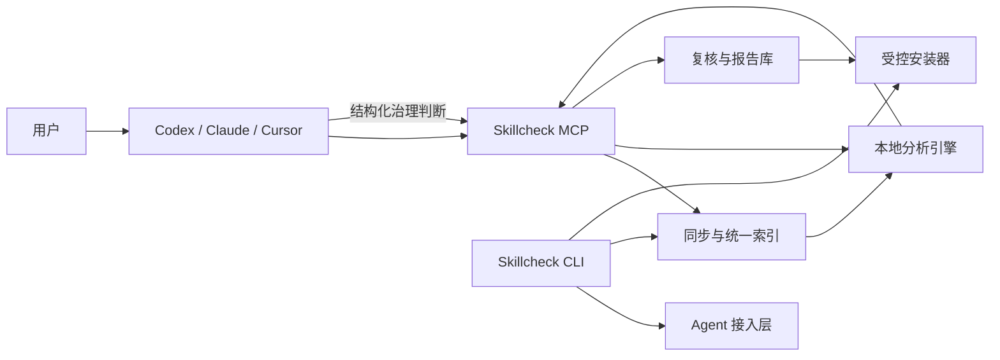

# Skillcheck v0.4.0：CodeGraph 模式重构设计

- 状态：已确认
- 日期：2026-08-10
- 目标用户：在个人电脑上使用 Codex、Claude Code、Cursor 等 Agent，并需要统一治理本地 Skills 的开发者
- 参考产品：[CodeGraph](https://github.com/colbymchenry/codegraph)

## 1. 背景

Skillcheck v0.3.x 已具备本地 Skill 发现、解析、重复候选分析、报告生成、Agent 配置和跨平台分发能力，但产品主流程仍以 CLI 扫描和额外启动 Codex/Claude CLI 复核为中心。这与 CodeGraph 的实际工作方式不同：CodeGraph 的 CLI 负责安装、接入和初始化，日常工作由当前 Agent 通过 MCP 完成，索引在 MCP 生命周期内自动同步。

v0.4.0 将彻底切换为 CodeGraph 模式。当前 Agent 是唯一的语义模型，Skillcheck 不再启动第二个 Agent 进程。

## 2. 已确认的产品决策

1. `skillcheck install` 检测并配置 Agent。
2. `skillcheck init` 建立个人 Skills 统一索引。
3. MCP 启动时补同步，运行期间监听文件变化，结束时停止监听；不安装常驻系统服务。
4. 日常分析由用户在当前 Agent 中提出，Agent 自动调用 Skillcheck MCP。
5. Agent 使用自身模型判断 Skill 应合并、删除、保留还是调整边界。
6. MCP 可以写入 Skillcheck 的索引、复核结果和报告，但不能修改、移动、删除或安装用户 Skill。
7. 一个个人总索引同时容纳全局与项目 Skill，并保留来源 Agent、作用域和项目归属。
8. 安装时同时写入 MCP 配置和带边界标记的 Agent 使用说明，卸载时精确移除。
9. 旧的 Codex/Claude Review Adapter、ReviewMode、兼容命令、交互菜单和旧数据库逻辑全部删除。
10. 项目尚无正式用户，不提供 v0.3.x 数据迁移或行为兼容。

## 3. 目标与非目标

### 3.1 目标

- 首次安装后只需执行 `install` 和 `init`。
- 日常使用不要求用户记忆扫描、分组、复核和报告命令。
- 在多个 Agent 和多个作用域之间识别重复、重叠、冲突与合理变体。
- 让本地规则负责确定性检查，让当前 Agent 负责模糊语义判断。
- 索引持续更新，并在结果可能过期时明确告知 Agent。
- 任何 Skill 文件写操作都必须回到 CLI 并获得用户确认。
- 没有 Agent 时仍提供纯本地基础扫描能力。

### 3.2 非目标

- 不训练或微调专用大模型。
- 不在后台运行常驻 Windows 服务、launchd 或 systemd 服务。
- 不让 MCP 自动合并、删除、覆盖或安装 Skill。
- 不兼容 v0.3.x 的命令别名、数据库或 Review Adapter。
- 不把知识图谱作为 v0.4.0 的必需基础设施；当前规模使用 SQLite、全文检索、本地向量和结构化证据即可。
- 不在 v0.4.0 同时扩展新的 Agent 类型；先稳定 Codex、Claude Code 和 Cursor。

## 4. 用户工作流程

### 4.1 安装程序本体

Windows：

```powershell
irm https://raw.githubusercontent.com/jjieYin/skillcheck/main/install.ps1 | iex
```

macOS/Linux：

```bash
curl -fsSL https://raw.githubusercontent.com/jjieYin/skillcheck/main/install.sh | sh
```

安装脚本只负责选择平台资产、校验 SHA-256、安装程序和配置 PATH，不修改 Agent 配置，也不扫描 Skills。

### 4.2 接入 Agent

```powershell
skillcheck install
```

流程：

```text
检测 Codex、Claude Code、Cursor
→ 用户选择目标 Agent 和 global/project 位置
→ 预览将修改的配置与指令文件
→ 用户确认
→ 写入 skillcheck serve --mcp 配置
→ 写入带标记的使用说明
→ 启动 MCP 冒烟验证
→ 提示重启 Agent
```

`install` 只接入 Agent，不建立索引。

### 4.3 初始化个人 Skills 库

```powershell
skillcheck init
```

程序自动发现标准全局目录、自定义目录和当前项目目录，展示后由用户确认，再建立统一索引和首次候选分组。初始化完成后，用户回到 Agent 中使用 Skillcheck。

### 4.4 日常治理

用户在 Agent 中提出：

> 检查我本机的 Skills 有没有重复，并给出合并、删除或调整边界的建议。

调用链：

```text
当前 Agent
→ skillcheck_analyze(mode="library")
→ skillcheck_evidence(group_id)
→ 当前 Agent 使用自身模型判断
→ skillcheck_save_review(run_id, decisions)
→ 生成 Markdown/JSON 报告
→ Agent 向用户解释结论
```

用户不需要知道 MCP 工具的具体调用顺序。

### 4.5 安装前检查

用户可以在 Agent 中提交本地目录、ZIP 或 GitHub URL。`skillcheck_analyze(mode="source")` 对来源进行暂存和本地检查，并与现有索引比较。Agent 保存语义结论后，向用户提供 CLI 命令：

```powershell
skillcheck add https://github.com/owner/repo
```

`add` 重新校验来源哈希，读取匹配的复核结果，展示目标路径和文件变化，只有用户确认后才执行原子安装。

### 4.6 无 Agent 回退

```powershell
skillcheck scan [目录]
```

`scan` 只执行本地同步、哈希、格式、安全和相似候选分析，并生成基础报告。它不启动任何 Agent，也不输出语义治理结论。

## 5. CLI 设计

| 命令 | 作用 |
|---|---|
| `skillcheck install` | 检测 Agent，写入 MCP 配置和指令文件 |
| `skillcheck init [目录]` | 发现 Skills 目录并建立统一索引 |
| `skillcheck status` | 查看 Agent 接入、索引、监听目录和同步状态 |
| `skillcheck sync` | 无 MCP 或监听不可用时手动同步 |
| `skillcheck scan [目录]` | 生成纯本地基础报告 |
| `skillcheck add SOURCE` | 安装前复核并确认安装 |
| `skillcheck serve --mcp` | 供 Agent 启动 stdio MCP Server |
| `skillcheck doctor` | 诊断程序、Agent 配置、索引和监听问题 |
| `skillcheck upgrade` | 更新 Skillcheck |
| `skillcheck uninstall` | 移除 Agent 接入或整个程序 |

无参数执行 `skillcheck` 时：

- 未配置：进入 `skillcheck install` 引导。
- 已配置：显示简洁状态，并提示用户回到 Agent 中提出需求。
- 不再显示交互式主菜单。

删除以下旧接口：

```text
setup
audit
check
report latest
install REPORT_ID
scan --review
所有旧命令转发
```

## 6. 总体架构



### 6.1 CLI 管理层

负责安装接入、初始化、状态、手动同步、回退扫描、受控安装和生命周期管理。CLI 不调用 Agent 模型。

### 6.2 Agent 接入层

复用并重构现有 `targets/`：

- 检测 Agent CLI 和配置文件。
- 生成 MCP 配置。
- 写入可识别、可更新、可卸载的指令标记块。
- 备份、原子写入并验证配置。
- 精确移除 Skillcheck 自己写入的内容，不影响其他 MCP Server。

### 6.3 统一索引层

保存 Skill 当前状态、内容快照、来源 Agent、作用域和项目归属。SQLite 提供结构化查询与全文检索，本地向量只负责候选召回。

### 6.4 同步引擎

CLI `sync` 和 MCP 共用同一实现：

```text
连接时 reconcile
→ 启动文件监听
→ 事件进入 debounce 队列
→ 增量解析和索引
→ 重新计算受影响候选组
→ MCP 结束时停止监听
```

### 6.5 本地分析引擎

本地引擎输出证据与候选，不替代 Agent 做模糊判断：

```text
EXACT_DUPLICATE
HIGH_OVERLAP_CANDIDATE
CONFLICT_CANDIDATE
VARIANT_CANDIDATE
QUALITY_ISSUE
SECURITY_ISSUE
```

完全重复、格式和安全问题可以形成确定性结论；重叠、冲突和变体由当前 Agent 判断。

### 6.6 复核与报告层

保存 Agent 的结构化判断，并与原始本地证据分层。Agent 结论只能追加，不能覆盖原始哈希、规则结果和证据。

### 6.7 受控安装器

负责来源暂存、哈希复验、安装计划、用户确认、原子写入和失败回滚。它是唯一可以修改用户 Skill 目录的模块。

## 7. MCP 设计

默认只暴露三个工具。

### 7.1 `skillcheck_analyze`

用途：统一发起库治理或来源预检。

输入：

```json
{
  "mode": "library",
  "source": null,
  "scope": "all",
  "limit": 20
}
```

`mode` 允许 `library` 或 `source`。`source` 模式必须提供本地目录、ZIP 或 GitHub URL。返回 `run_id`、同步状态、摘要、候选组 ID、确定性问题和推荐的下一步工具调用。

### 7.2 `skillcheck_evidence`

用途：按候选组读取详细证据。

输入：

```json
{
  "run_id": "run-20260810-001",
  "group_id": "group-001",
  "page": 1,
  "include_body": true
}
```

返回共同能力、差异能力、工具、权限、环境、来源、正文和 `stale` 状态。正文过长时分页；敏感字段默认脱敏。

### 7.3 `skillcheck_save_review`

用途：保存当前 Agent 的结构化治理判断并生成报告。

输入：

```json
{
  "run_id": "run-20260810-001",
  "decisions": [
    {
      "group_id": "group-001",
      "decision": "MERGE",
      "canonical_skill": "api-validator",
      "confidence": 0.88,
      "reason": "两个 Skill 的主要执行流程一致",
      "recommendations": [
        "保留 api-validator",
        "合并另一个 Skill 的 Schema 校验示例"
      ]
    }
  ]
}
```

允许的结论：

```text
KEEP_BOTH
MERGE
DEPRECATE
DELETE_DUPLICATE
RENAME
REWRITE_BOUNDARY
MANUAL_REVIEW
```

保存前必须验证 run、group、当前内容快照和 JSON Schema。内容已变化时拒绝保存旧判断，并要求 Agent重新读取证据。

## 8. Agent 指令设计

`skillcheck install` 除 MCP 配置外，还向 Agent 指令文件写入带边界标记的片段：

```text
<!-- SKILLCHECK_START -->
当用户询问本地 Skills 的重复、冲突、边界或安装前检查时，优先使用 Skillcheck MCP。
先调用 skillcheck_analyze，再按需读取 skillcheck_evidence。
形成判断后调用 skillcheck_save_review。
不要直接删除、覆盖或移动 Skill；写操作必须交给 skillcheck add 或后续受控 CLI。
<!-- SKILLCHECK_END -->
```

安装器重复运行时更新现有标记块，不追加重复内容；卸载时只删除该标记块。

## 9. 索引与数据模型

个人数据目录：

```text
~/.skillcheck/
├── config.yaml
├── index.db
├── reports/
├── cache/
└── staging/
```

v0.4.0 使用一份新的完整数据库基线，不提供旧数据库迁移。若检测到不符合 v0.4.0 Schema 的实验数据库，程序直接停止并提示清理 `~/.skillcheck/` 后重新执行 `install` 和 `init`；不自动备份、导入或转换旧数据。

核心表：

| 表 | 作用 |
|---|---|
| `library_roots` | 全局、自定义和项目 Skills 目录 |
| `skills` | Skill 当前路径、作用域、来源 Agent 和状态 |
| `skill_snapshots` | 内容哈希、解析字段、正文和更新时间 |
| `sync_events` | 新增、修改、删除和同步错误 |
| `analysis_runs` | 库检查或来源检查运行记录 |
| `candidate_groups` | 重复、重叠、冲突和变体候选组 |
| `group_members` | 候选组成员 |
| `evidence` | 相同点、差异点、权限、工具和正文证据 |
| `agent_reviews` | 当前 Agent 保存的语义结论 |
| `reports` | Markdown/JSON 报告元数据 |
| `source_preflights` | 来源暂存、哈希和安装前检查 |
| `install_plans` | 待确认的目标路径与文件变化 |

稳定标识：

```text
skill_id = 标准化来源 + 作用域 + 相对路径
snapshot_id = skill_id + content_hash
```

同一 Skill 内容改变时生成新快照；任何旧快照上的 Agent 判断自动失效。

## 10. 自动同步与一致性

同步采用三层保护：

1. **连接补同步**：MCP 启动后，在第一次分析前比较路径、大小、修改时间和内容哈希。
2. **运行时监听**：监听新增、修改和删除事件，并使用 debounce 合并突发变化。
3. **查询前校验**：`analyze` 和 `evidence` 检查待处理事件；涉及待同步文件时返回 `stale`，不允许形成最终结论。

不启动常驻后台服务。监听随 MCP 启停，CLI `sync` 为无 MCP 或受限环境提供手动入口。

## 11. 安全边界

- MCP 可以更新 Skillcheck 自己的索引、复核和报告。
- MCP 不得写入任何 Skill 目录。
- `scan`、`analyze`、`evidence` 默认只读用户数据。
- 下载来源只进入受限 staging 目录，限制文件数量、总大小、单文件大小和路径深度。
- ZIP 必须防止路径穿越和符号链接逃逸。
- GitHub URL 只允许 HTTPS，固定解析后的提交哈希。
- Agent 返回内容按 JSON Schema 校验，并绑定 run、group 和 snapshot。
- 报告使用临时文件加原子替换。
- 安装、覆盖、移动和删除必须由 CLI 展示精确路径并再次确认。
- 配置写入前备份，失败时恢复原文件。

## 12. 异常与降级

| 情况 | 行为 |
|---|---|
| 单个 `SKILL.md` 解析失败 | 标记为 `INVALID`，记录错误，继续同步其他 Skill |
| 文件监听不可用 | 启动时和每次 analyze 前快速同步，并返回警告 |
| 文件尚未同步 | evidence 返回 `stale`，拒绝保存相关结论 |
| 数据库写锁冲突 | 短暂重试；超时后提供最后稳定只读结果 |
| save_review 不符合 Schema | 拒绝写入并返回具体字段错误 |
| 来源获取失败 | 清理 staging，不产生 install plan，不修改索引 |
| 尚未执行 init | MCP 返回初始化指引，不扫描未知目录 |
| 报告写入失败 | 保留数据库结果和临时文件，返回可诊断错误 |

## 13. 旧实现删除范围

直接删除：

- `ReviewMode` 和所有 `--review` 参数。
- Codex/Claude CLI Review Adapter。
- 外部 Agent 进程调用、packet 分批和旧复核编排。
- 交互式主菜单。
- `setup` 及旧命令转发。
- 旧 MCP 摘要、分组、报告三工具接口。
- 旧数据库迁移和旧报告兼容逻辑。
- 对应测试、Fixture、文档和配置字段。

保留并重构：

- Agent Target Adapter。
- Skill 发现、解析、校验、相似召回和规则分析。
- SQLite 存储基础设施，但替换为新基线 Schema。
- 来源暂存与安全检查。
- 安装计划、原子安装和回滚。
- Markdown/JSON 报告生成。
- `doctor`、`upgrade`、`uninstall` 和跨平台 Release。

## 14. 测试设计

### 14.1 单元测试

- 目录发现、作用域与来源 Agent。
- 稳定 Skill ID、快照和内容哈希。
- 新增、修改和删除的增量同步。
- debounce 和连接补同步。
- 候选召回、证据构建和 stale 状态。
- 三个 MCP 工具的输入、输出和错误 Schema。
- `save_review` 的快照绑定与写入边界。
- Agent 配置和指令标记块的精确写入、更新和删除。
- 来源哈希、安装计划、原子安装和回滚。

### 14.2 集成测试

```text
init → 建立索引 → 修改 SKILL.md → MCP 自动同步
analyze → evidence → save_review → Markdown/JSON
source preflight → Agent 结论 → add → 用户确认 → 原子安装
install → 写入三个 Agent 配置 → 重复执行不产生重复项
uninstall → 删除 Skillcheck 内容 → 保留其他 MCP Server
```

### 14.3 用户旅程验收

1. Windows、macOS、Linux 干净环境安装，无需 Python。
2. `skillcheck install` 接入 Codex、Claude Code、Cursor。
3. `skillcheck init` 建立个人统一索引。
4. Agent 完成一次重复检查并保存报告。
5. 修改 Skill 后，下一次 MCP 查询获得新快照。
6. 没有 Agent 时，`skillcheck scan` 生成基础报告。
7. MCP 无法修改或删除 Skill。
8. `skillcheck add` 未确认时不写入目标目录。
9. 中文路径、空格路径和大量 Skills 正常工作。
10. `upgrade/uninstall` 不破坏无关 Agent 配置。

质量门禁：

```text
ruff
mypy
pytest
MCP 合同测试
Windows/macOS/Linux Release 构建
安装脚本冒烟测试
```

## 15. 发布边界

v0.4.0 是破坏性重构版本。发布说明必须明确：

- v0.3.x 配置、索引和命令不受支持。
- 用户必须重新执行 `skillcheck install` 和 `skillcheck init`。
- 默认日常入口从 CLI 扫描切换为 Agent + MCP。
- CLI 保留无 Agent 回退和所有受控写操作。

完成条件：设计中的三个 MCP 工具、自动同步、Agent 接入、统一索引、回退扫描和受控安装全部通过验收后，才允许发布 v0.4.0。
