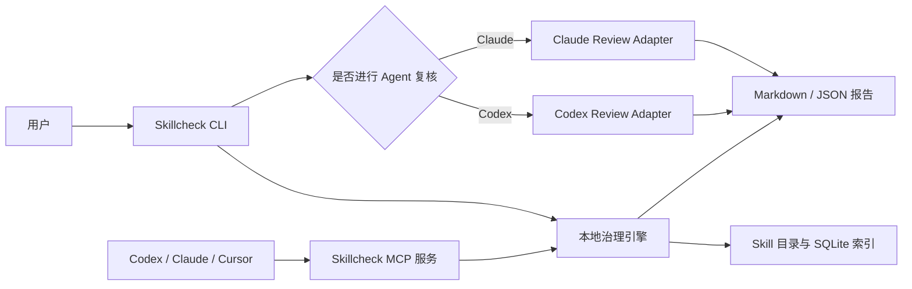
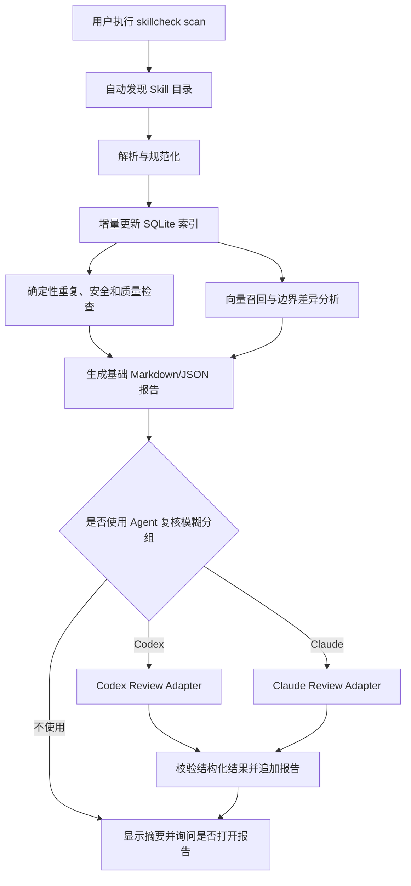
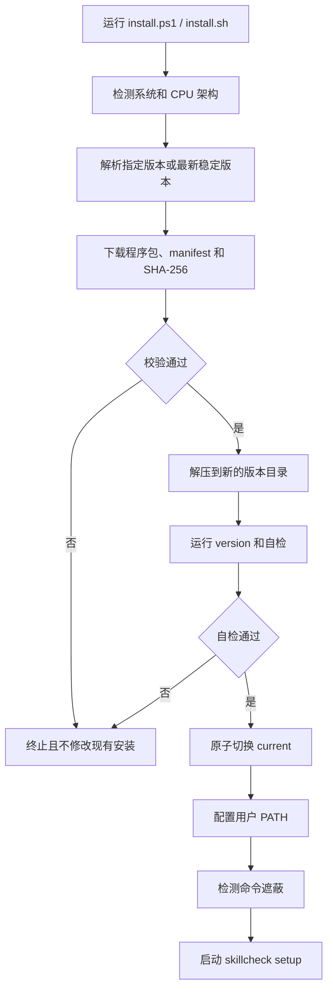
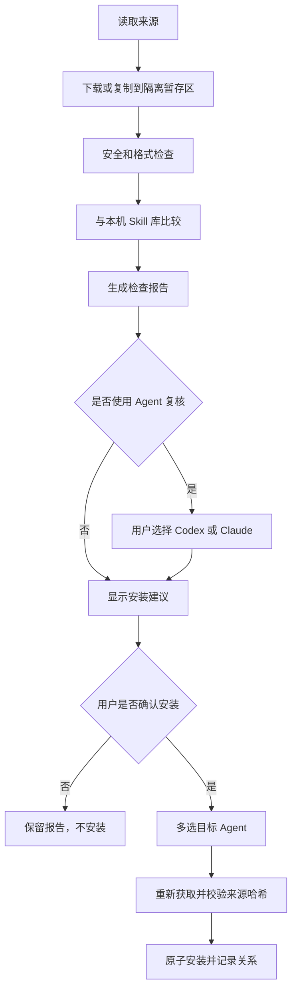

# Skillcheck v2：自包含分发、简化 CLI 与 Agent 辅助复核设计

- 状态：第一、二、三部分已确认
- 日期：2026-08-10
- 目标用户：在个人电脑上同时使用 Codex、Claude Code、Cursor 等 Agent，并需要管理本地 Skills 的个人开发者
- 设计参照：[CodeGraph](https://github.com/colbymchenry/codegraph)

## 0. 背景与已确认决策

当前版本能够完成本地 Skill 发现、索引、重复检测、安全检查、安装前检查和报告生成，但普通用户需要准备 Python、创建虚拟环境、安装依赖、理解多个命令并手工传递报告 ID。Windows 中文路径和 Python 可编辑安装还会带来额外兼容问题。

新版已经确认以下产品方向：

1. 普通用户不需要安装 Python；发布自包含程序，`pip` 仅用于开发。
2. `skillcheck` 无参数时进入交互式向导。
3. 自动检测 Codex、Claude Code、Cursor，并让用户多选需要接入的 Agent。
4. `skillcheck scan [目录]` 一次完成发现、索引、冗余分析和报告生成；不再要求用户先执行 `init` 和 `audit`。
5. `skillcheck add [来源]` 支持本地目录、ZIP 和 GitHub URL，一次完成获取、检查、建议和确认安装。
6. 终端先显示摘要和高优先级问题，同时自动生成 Markdown/JSON，并询问是否打开 Markdown 报告。
7. 基础分析完全在本地完成；扫描结束后由用户决定是否调用本机已登录的 Codex 或 Claude Code 做语义复核。
8. 不要求普通用户再次配置 OpenAI、千问等 API Key，也不读取 Agent 凭据。
9. 提供 `doctor`、`upgrade` 和 `uninstall`，覆盖完整生命周期。
10. CLI 是主入口；MCP 是安装后可选的 Agent 接入能力，不把自然语言对话作为安装、初始化和扫描的必经入口。

## 第一部分：总体架构与用户主流程

### 1.1 设计原则

新版遵循五条原则：

- **一个任务对应一个高层命令**：扫描现有库使用 `scan`，检查新来源使用 `add`。
- **复杂步骤封装在程序内部**：用户不需要理解索引、召回、报告 ID 和哈希校验的调用顺序。
- **CLI 始终可独立工作**：没有 Agent、没有网络或 Agent 调用失败时，基础治理能力仍然可用。
- **Agent 只负责模糊语义判断**：确定性重复、安全和格式问题由本地引擎判断。
- **写操作必须明确确认**：扫描和检查默认只读，安装、覆盖、移动和删除需要再次确认。

### 1.2 双入口架构

Skillcheck 提供两个入口，但以 CLI 为主：



CLI 负责安装、配置、扫描、检查、安装新 Skill 和生命周期管理。MCP 配置完成后，Agent 可以按需读取 Skillcheck 的索引或报告，但 MCP 不替代 CLI 主流程。

### 1.3 系统组件

```text
skillcheck
├── launcher          稳定启动器与版本切换
├── setup             首次向导与 Agent 自动配置
├── targets           Codex、Claude、Cursor 配置适配器
├── discovery         本地 Skill 目录发现
├── parser            SKILL.md 解析与规范化
├── index             SQLite 索引与增量更新
├── analysis          重复、重叠、冲突和安全分析
├── reviewers         Codex、Claude CLI 语义复核适配器
├── reports           Markdown/JSON 报告
├── installer         新 Skill 暂存、校验与安装
├── mcp               可选 MCP 服务
├── doctor            环境诊断与受控修复
├── upgrade           下载、校验、切换和回滚
└── uninstall         Agent 配置和程序精确卸载
```

各组件只通过明确的数据模型交互。Agent Target Adapter 负责写入 Agent 配置，Agent Review Adapter 负责调用 Agent CLI，两者不得混在同一个模块中。

### 1.4 普通用户主流程

首次安装：

```text
运行一行安装命令
→ 下载自包含程序
→ 执行 skillcheck setup
→ 自动检测 Agent
→ 用户多选并确认配置范围
→ 写入 MCP 配置
→ 完成
```

日常扫描：

```powershell
skillcheck scan
```

检查并安装新 Skill：

```powershell
skillcheck add https://github.com/owner/repository
```

无参数入口：

```powershell
skillcheck
```

显示交互菜单：

```text
Skillcheck

> 扫描现有 Skills
  检查并安装新 Skill
  查看最近报告
  配置 Agent
  检查运行环境
  退出
```

### 1.5 首次 Agent 配置

向导自动检测 Agent 的 CLI、配置目录和 Skill 目录，并默认勾选已安装项：

```text
请选择需要接入 Skillcheck 的 Agent：

[x] Codex         已检测到
[x] Claude Code   已检测到
[x] Cursor        已检测到
```

随后选择作用范围：

```text
> 全局：当前用户所有项目可使用
  当前项目：仅当前项目使用
```

写入前必须展示将修改的文件、将添加的 MCP 项和稳定启动器路径。用户确认后才执行写入。

### 1.6 精简后的公开命令

| 命令 | 面向用户的作用 |
|---|---|
| `skillcheck` | 打开交互式主菜单 |
| `skillcheck setup` | 检测和配置 Agent |
| `skillcheck scan [目录]` | 扫描、审计并生成报告 |
| `skillcheck add [来源]` | 检查并确认安装新 Skill |
| `skillcheck doctor` | 检查安装、Agent 和索引状态 |
| `skillcheck upgrade` | 更新或回滚 Skillcheck |
| `skillcheck uninstall` | 卸载 Agent 配置或程序 |

以下为内部或高级接口，不出现在普通快速开始中：

```text
skillcheck serve --mcp
skillcheck internal index
skillcheck internal report
```

旧命令保留一个兼容周期并显示迁移提示：

| 旧命令 | 兼容行为 |
|---|---|
| `skillcheck init` | 转发到 `setup` |
| `skillcheck audit` | 转发到 `scan` |
| `skillcheck check SOURCE` | 转发到 `add SOURCE --check-only` |
| `skillcheck report latest` | 作为高级命令保留 |
| `skillcheck install REPORT_ID` | 作为内部兼容命令保留 |

### 1.7 默认安全边界

- `scan`、来源暂存、比较和报告生成默认只读。
- Agent 复核只能追加建议，不能修改 Skill 文件。
- 安装、覆盖、移动和删除必须显示目标路径并再次确认。
- 写操作绑定扫描报告、来源哈希和短期批准令牌；来源变化后原批准失效。
- 报告区分本地证据、规则结论和 Agent 建议。
- 默认只向 Agent 发送模糊分组所需的摘要、差异和正文片段。
- 任何 Agent 失败都不得导致基础报告丢失。

## 第二部分：扫描、冗余识别与可选 Agent 复核

### 2.1 `scan` 的完整数据流程



`scan` 在首次运行时自动创建配置、索引和报告目录，不要求用户先执行 `init`。

### 2.2 自动发现范围

默认发现：

- `~/.codex/skills`
- `~/.agents/skills`
- `~/.claude/skills`
- `~/.cursor/rules`
- 当前项目下对应的 `.codex`、`.agents`、`.claude`、`.cursor` 目录
- 用户在设置向导中增加的自定义目录

`skillcheck scan D:\custom\skills` 将指定目录加入本次扫描，但不必永久写入配置；向导可询问是否保存为常用目录。

### 2.3 本地确定性分析

本地引擎始终先完成以下工作：

1. 解析 frontmatter 和正文，提取名称、描述、工具、权限、环境、输入和输出。
2. 计算标准化内容哈希，识别完全重复。
3. 运行格式、质量、密钥、危险命令和隐藏 Unicode 检查。
4. 使用名称、描述、标签、正文摘要和本地向量执行 Top-K 召回。
5. 比较候选的工具、权限、环境、执行步骤和输入输出。
6. 形成治理分组，并记录证据和规则建议。

本地结果分为：

| 类型 | 说明 | 是否需要 Agent |
|---|---|---:|
| `EXACT_DUPLICATE` | 标准化正文和实现字段一致 | 否 |
| `QUALITY_ISSUE` | 格式、完整性或安全问题 | 否 |
| `HIGH_OVERLAP` | 目标和实现高度相似但不完全一致 | 是 |
| `VARIANT_GROUP` | 技术栈、环境或权限不同 | 是 |
| `CONFLICT_GROUP` | 边界或权限存在冲突 | 是 |
| `MANUAL_REVIEW` | 证据不足或置信度较低 | 是 |

### 2.4 终端摘要与 Agent 选择

基础报告完成后显示：

```text
扫描完成

126 个 Skill
4 组完全重复
8 组边界重叠
2 组潜在冲突
5 个质量问题

基础报告：C:\Users\AH\.skillcheck\reports\2026-08-10-review.md

是否使用 Agent 进一步复核 10 个模糊分组？

> 不使用，直接查看基础报告
  使用 Codex
  使用 Claude Code
```

在非交互环境中使用：

```powershell
skillcheck scan --review none
skillcheck scan --review codex
skillcheck scan --review claude
```

`--review` 是高级参数；普通用户通过菜单选择。默认值为 `none`，程序不得在无人确认时消耗 Agent 模型额度。

### 2.5 Agent Review Adapter

```text
reviewers/
├── base.py
├── registry.py
├── codex.py
└── claude.py
```

统一接口：

```python
class ReviewAdapter:
    def detect(self) -> ReviewCapability: ...
    def review(self, packet: ReviewPacket) -> AgentReview: ...
```

Adapter 负责：

- 检测 Agent 的可执行文件；
- 使用 Agent 已有的登录状态和模型配置；
- 通过标准输入传递复核包，避免命令行转义和长度问题；
- 使用只读或无工具模式；
- 要求输出符合统一 JSON Schema；
- 设置超时、输出上限和可选成本上限；
- 校验输出并返回明确的降级原因。

Windows 上优先调用 `.exe` 或 `.cmd`，避免 PowerShell 执行策略阻止 `.ps1`。

当前目标能力：

| Agent | MCP 接入 | CLI 语义复核 |
|---|---:|---:|
| Codex | 支持 | 支持 |
| Claude Code | 支持 | 支持 |
| Cursor | 支持 | 暂不支持 |
| 通用 Agents 目录 | 仅扫描目录 | 不支持 |

Codex Adapter 使用非交互、临时会话、只读沙箱和 JSON Schema；Claude Adapter 使用非交互打印、无会话持久化、受限工具和 JSON Schema。具体参数由 Adapter 封装，不暴露给普通用户。

### 2.6 Agent 复核包

只把模糊分组发送给用户选择的 Agent：

```json
{
  "task": "判断以下 Skill 应该合并、停用、改名、修改边界还是分别保留",
  "groups": [
    {
      "group_id": "overlap-001",
      "skills": [
        {
          "name": "api-test",
          "description": "测试 REST API",
          "tools": ["curl"],
          "permissions": ["network"],
          "body_excerpt": "..."
        },
        {
          "name": "rest-api-validator",
          "description": "校验 REST API 响应",
          "tools": ["curl", "jq"],
          "permissions": ["network"],
          "body_excerpt": "..."
        }
      ],
      "similarity": 0.91,
      "shared_capabilities": ["发送接口请求", "校验响应"],
      "different_capabilities": ["报告生成", "Schema 校验"],
      "rule_result": "HIGH_OVERLAP"
    }
  ]
}
```

发送策略：

- 默认发送名称、描述、工具、权限、环境、相同点、差异点和必要正文片段。
- 完全重复和明确安全问题不进入 Agent 复核包。
- 检测到凭据的正文必须脱敏或省略。
- 单次复核包设置分组数和字符上限，超出时分批复核。
- 用户明确允许后才可发送完整正文。

### 2.7 Agent 返回结构

```json
{
  "groups": [
    {
      "group_id": "overlap-001",
      "decision": "MERGE",
      "confidence": 0.86,
      "reason": "两个 Skill 的主要执行流程相同，差异集中在响应校验能力。",
      "canonical_skill": "rest-api-validator",
      "recommendations": [
        "将 api-test 的通用请求示例合并到 rest-api-validator",
        "在 description 中明确支持 Schema 校验",
        "合并后停用 api-test"
      ]
    }
  ]
}
```

允许的治理建议限定为：

```text
KEEP_BOTH
MERGE
DEPRECATE
DELETE_DUPLICATE
RENAME
REWRITE_BOUNDARY
MANUAL_REVIEW
```

返回结果必须通过 JSON Schema；无法校验时不写入正式 Agent 复核区。

### 2.8 报告合并与来源标记

最终 Markdown 明确分层：

```markdown
## 确定性检查结论

- 内容哈希一致
- 检测到危险命令

## 本地相似度分析

- 正文相似度：0.91
- 共同工具：curl

## Agent 语义复核

- 复核 Agent：Codex
- 建议：合并
- 置信度：0.86
- 理由：……
```

Agent 建议只能追加，不能覆盖原始证据。JSON 中记录 Agent 名称、调用时间、结果 Schema 版本和是否使用完整正文，不记录登录 Token 或 API Key。

### 2.9 失败与降级

以下情况只影响 Agent 复核，不影响基础扫描：

- Agent CLI 不存在或未登录；
- 网络不可用；
- 调用超时或被用户取消；
- 返回内容不符合 JSON Schema；
- Agent 拒绝访问输入；
- 单次复核达到成本或输出限制。

终端示例：

```text
Codex 复核未完成：当前登录状态不可用。
基础审计报告已保留，未丢失任何本地检查结果。
```

## 第三部分：安装、Agent 配置与生命周期管理

### 3.1 多种安装方式

#### 一行安装（主要方式）

Windows：

```powershell
irm https://raw.githubusercontent.com/jjieYin/skillcheck/main/install.ps1 | iex
```

macOS/Linux：

```bash
curl -fsSL https://raw.githubusercontent.com/jjieYin/skillcheck/main/install.sh | sh
```

#### 便携版

用户可以直接从 GitHub Releases 下载、解压并运行，不修改 PATH 和 Agent 配置。

#### 包管理器

Release 稳定后提供：

```powershell
winget install jjieYin.skillcheck
scoop install skillcheck
```

```bash
brew install jjieYin/tap/skillcheck
```

#### Python 开发安装

```powershell
git clone https://github.com/jjieYin/skillcheck.git
cd skillcheck
python -m pip install ".[dev]"
```

普通用户文档不再把 Python、虚拟环境和可编辑安装作为主路径。

### 3.2 自包含构建方案

v2 采用 PyInstaller one-folder 模式构建各平台包。选择 one-folder 而不是单文件，原因是启动更快、资源文件更清晰，并且版本目录可以原子切换和回滚。

Release 资产：

```text
skillcheck-windows-x64.zip
skillcheck-windows-arm64.zip
skillcheck-macos-x64.tar.gz
skillcheck-macos-arm64.tar.gz
skillcheck-linux-x64.tar.gz
skillcheck-linux-arm64.tar.gz
checksums-sha256.txt
release-manifest.json
```

默认离线 hash embedding 包含在主程序中。`sentence-transformers` 和模型文件不进入默认安装包，后续通过可选组件下载。

### 3.3 程序和状态目录

| 内容 | Windows | macOS/Linux |
|---|---|---|
| 程序 | `%LOCALAPPDATA%\skillcheck` | `~/.local/share/skillcheck` |
| 配置 | `%USERPROFILE%\.skillcheck\config.yaml` | `~/.skillcheck/config.yaml` |
| 索引 | `%USERPROFILE%\.skillcheck\index.db` | `~/.skillcheck/index.db` |
| 报告 | `%USERPROFILE%\.skillcheck\reports` | `~/.skillcheck/reports` |
| 缓存 | `%USERPROFILE%\.skillcheck\cache` | `~/.skillcheck/cache` |
| 备份 | `%USERPROFILE%\.skillcheck\backups` | `~/.skillcheck/backups` |

程序与数据分离，升级程序时不得删除索引、报告或用户配置。

Windows 程序目录：

```text
%LOCALAPPDATA%\skillcheck\
├── versions\
│   ├── 0.2.0\
│   └── 0.3.0\
├── current\
├── bin\
│   └── skillcheck.cmd
└── install.json
```

`bin\skillcheck.cmd` 是稳定入口，Agent 配置不得引用具体版本目录。

### 3.4 安装脚本流程

设计借鉴 CodeGraph 的平台检测、GitHub Release 下载和用户 PATH 管理，但增加校验、原子切换和回滚：[CodeGraph Windows installer](https://github.com/colbymchenry/codegraph/blob/main/install.ps1)。



安装规则：

- 默认安装在用户目录，不要求管理员权限。
- 下载和解压使用独立临时目录。
- 新版本自检通过后才切换。
- 保留上一版本用于回滚。
- 检测 PATH 中旧的 `skillcheck`，提示实际执行路径。
- 支持环境变量指定安装版本和安装目录。
- 安装脚本重复执行时必须幂等。

### 3.5 Agent Target Adapter

```text
targets/
├── base.py
├── registry.py
├── codex.py
├── claude.py
├── cursor.py
└── agents.py
```

统一接口：

```python
class AgentTarget:
    def detect(self) -> DetectionResult: ...
    def preview(self, scope) -> ConfigChange: ...
    def install(self, scope) -> InstallResult: ...
    def uninstall(self, scope) -> UninstallResult: ...
    def validate(self, scope) -> ValidationResult: ...
```

检测结果分为：

- CLI 是否存在；
- Agent 配置目录是否存在；
- Skill 目录是否存在；
- Skillcheck MCP 是否已经配置；
- 是否支持全局和项目范围；
- 是否支持 CLI 语义复核。

写入前展示：

```text
即将修改：

C:\Users\AH\.codex\config.toml
C:\Users\AH\.claude.json
D:\project\.cursor\mcp.json

将添加 Skillcheck MCP：
command = C:\Users\AH\AppData\Local\skillcheck\bin\skillcheck.cmd
args    = serve --mcp

不会修改其他 MCP Server。
```

配置写入必须：

- 先备份，再使用临时文件原子替换；
- 保留未知字段和其他 MCP Server；
- 重复执行不产生重复配置；
- 无权限写入时输出可复制的配置片段；
- 卸载时只删除 Skillcheck 自己的配置项或带标记区块。

### 3.6 MCP 配置

示意配置：

```json
{
  "mcpServers": {
    "skillcheck": {
      "command": "C:/Users/AH/AppData/Local/skillcheck/bin/skillcheck.cmd",
      "args": ["serve", "--mcp"]
    }
  }
}
```

v2 的 MCP 只提供少量任务级只读工具，用于查询索引、治理分组和已有报告；内部索引、分组和报告步骤不逐个暴露。安装、覆盖、移动和删除仍通过 CLI 执行，不在 v2 的 MCP 中开放写操作。

CLI 扫描调用 Agent Review Adapter，与 MCP 服务互不依赖。即使用户不配置 MCP，只要本机 Codex 或 Claude CLI 已登录，也可以选择语义复核。

### 3.7 `skillcheck add` 流程

支持：

```powershell
skillcheck add D:\skills\my-skill
skillcheck add D:\downloads\my-skill.zip
skillcheck add https://github.com/owner/repository
```

不提供来源时通过菜单选择本地目录、ZIP 或 GitHub URL。



同一个 Skill 安装到多个 Agent 时，优先采用统一存储加链接；目标平台或权限不支持链接时使用独立复制，并在安装清单中记录每个副本。

### 3.8 `skillcheck doctor`

检查：

- Skillcheck 版本和自包含 Runtime；
- PATH 中实际执行的命令和旧版遮蔽；
- 配置文件是否可解析；
- SQLite 索引健康和报告目录权限；
- Codex、Claude、Cursor 的检测与 MCP 配置；
- Codex、Claude 非交互复核能力；
- MCP 服务是否能够启动并完成初始化握手；
- 安装目录、版本指针和回滚版本是否一致。

默认只读：

```powershell
skillcheck doctor
```

受控修复：

```powershell
skillcheck doctor --fix
```

`--fix` 必须展示改动并确认，不得输出 API Key、Token、完整 Agent 配置或敏感 Skill 正文。

### 3.9 `skillcheck upgrade`

```powershell
skillcheck upgrade
skillcheck upgrade --check
skillcheck upgrade 0.3.0
skillcheck upgrade --rollback
```

流程：

```text
检查 Release
→ 显示当前版本和目标版本
→ 下载到临时目录
→ 校验 SHA-256
→ 执行新版本自检
→ 原子切换 current
→ 保留上一版本
```

Windows 使用独立更新辅助进程，避免正在运行的程序无法被覆盖。由于 Agent 配置引用稳定启动器，升级后不需要重新配置 Agent。

如果检测到 `pip` 开发安装，`upgrade` 不覆盖开发环境，只输出对应的开发安装命令。

### 3.10 `skillcheck uninstall`

```powershell
skillcheck uninstall
```

交互选择：

```text
请选择要移除的内容：

[x] Codex MCP 配置
[x] Claude MCP 配置
[x] Cursor MCP 配置
[x] Skillcheck 程序
[ ] 本地索引
[ ] 历史报告
[ ] 用户配置
```

默认保留索引、报告、用户配置和已经安装的 Skills。卸载前展示具体文件路径；只移除 Skillcheck 写入的 Agent 配置。Windows 由卸载辅助进程在主进程退出后删除程序文件，并输出无法自动清理的残留路径。

## 第四部分：模块重构、数据结构、迭代范围与验收标准

### 4.1 重构目标

当前版本的主要问题不是基础能力不足，而是 `cli.py` 和 `service.py` 同时承担了命令参数解析、配置加载、服务构建、扫描编排、Agent 调用、报告输出和退出码处理等职责。

v2 重构目标：

- CLI 只负责接收用户输入和展示结果；
- 业务流程由独立 Pipeline 编排；
- Agent 配置与 Agent 复核分离；
- 本地确定性结论与模型建议分离；
- 安装、升级和卸载拥有独立安全边界；
- 每个模块可以使用 Fake Adapter 独立测试；
- 保留现有解析、检索、审计和安全检查能力。

### 4.2 新目录结构

```text
src/skillcheck/
├── app/
│   ├── main.py
│   ├── menu.py
│   └── context.py
├── commands/
│   ├── setup.py
│   ├── scan.py
│   ├── add.py
│   ├── doctor.py
│   ├── upgrade.py
│   └── uninstall.py
├── pipelines/
│   ├── scan_pipeline.py
│   ├── add_pipeline.py
│   ├── setup_pipeline.py
│   └── review_pipeline.py
├── core/
│   ├── discovery.py
│   ├── parser.py
│   ├── retrieval.py
│   ├── audit.py
│   ├── decisions.py
│   └── validators.py
├── targets/
│   ├── base.py
│   ├── registry.py
│   ├── codex.py
│   ├── claude.py
│   ├── cursor.py
│   └── agents.py
├── reviewers/
│   ├── base.py
│   ├── registry.py
│   ├── codex.py
│   ├── claude.py
│   └── schemas/
│       └── agent-review.schema.json
├── sources/
│   ├── local.py
│   ├── archive.py
│   ├── github.py
│   └── staging.py
├── installation/
│   ├── planner.py
│   ├── executor.py
│   ├── manifest.py
│   └── rollback.py
├── reports/
│   ├── builder.py
│   ├── markdown.py
│   ├── json_report.py
│   └── viewer.py
├── storage/
│   ├── database.py
│   ├── migrations.py
│   ├── repositories.py
│   └── schema/
├── lifecycle/
│   ├── doctor.py
│   ├── upgrade.py
│   ├── uninstall.py
│   └── release_manifest.py
├── mcp/
│   ├── server.py
│   ├── tools.py
│   └── instructions.py
├── config/
│   ├── models.py
│   ├── loader.py
│   └── migration.py
└── models/
    ├── skill.py
    ├── audit.py
    ├── review.py
    ├── report.py
    └── installation.py
```

### 4.3 现有模块迁移

| 当前文件 | v2 去向 |
|---|---|
| `cli.py` | 拆为 `app/` 和 `commands/` |
| `service.py` | 拆为 `pipelines/` |
| `config.py` | 拆为 `config/models.py`、`loader.py`、`migration.py` |
| `discovery.py` | 移入 `core/`，补充 Agent Target 提供的目录 |
| `audit.py` | 移入 `core/`，只负责确定性治理分析 |
| `llm.py` | 替换为 `reviewers/`，默认不再直接调用 OpenAI API |
| `installer.py` | 拆为安装计划、执行、回滚和清单 |
| `sources.py` | 拆为本地、ZIP、GitHub 和暂存模块 |
| `reports.py` | 拆为报告模型、Markdown、JSON 和查看器 |
| `store.py` | 拆为数据库、迁移和 Repository |
| `skillspector.py` | 保留为可选 Validator Adapter |

原有核心逻辑优先迁移，不进行无必要重写。

### 4.4 Pipeline 边界

#### ScanPipeline

```python
class ScanPipeline:
    def run(
        self,
        scope: ScanScope,
        review: ReviewMode,
    ) -> ScanOutcome:
        ...
```

负责：

```text
发现目录
→ 解析
→ 更新索引
→ 本地审计
→ 写基础报告
→ 可选 Agent 复核
→ 写最终报告
→ 返回终端摘要
```

#### AddPipeline

```python
class AddPipeline:
    def run(
        self,
        source: SkillSource,
        targets: list[AgentId],
        review: ReviewMode,
    ) -> AddOutcome:
        ...
```

负责：

```text
暂存来源
→ 解析和安全检查
→ 与现有库比较
→ 可选 Agent 复核
→ 生成安装计划
→ 用户确认
→ 重新校验哈希
→ 安装
```

#### SetupPipeline

负责 Agent 检测、预览、备份、写入和验证，不负责调用模型。

#### ReviewPipeline

只接收已经形成的模糊治理分组，不直接扫描目录或修改 Skill。

### 4.5 关键数据模型

#### ScanRun

```python
class ScanRun:
    run_id: str
    started_at: datetime
    completed_at: datetime | None
    scopes: list[str]
    index_revision: str
    capabilities: list[str]
    skill_count: int
    finding_count: int
    status: str
```

用于关联一次扫描产生的分组、复核和报告。

#### GovernanceGroup

```python
class GovernanceGroup:
    group_id: str
    relation: Relation
    member_skill_ids: list[str]
    similarity: float | None
    evidence: list[Evidence]
    rule_suggestion: str
    requires_semantic_review: bool
```

#### Evidence

```python
class Evidence:
    kind: str
    source_skill_id: str
    target_skill_id: str | None
    value: str
    excerpt: str | None
    excerpt_hash: str | None
    sensitive: bool
```

正文片段与哈希同时记录，便于证明报告引用的是扫描时内容。

#### AgentReview

```python
class AgentReview:
    review_id: str
    run_id: str
    agent: str
    status: str
    schema_version: str
    full_text_shared: bool
    decisions: list[AgentDecision]
    error: str | None
```

不得存储 Agent 的 Token、API Key 或完整登录配置。

#### InstallationPlan

```python
class InstallationPlan:
    plan_id: str
    source: str
    source_hash: str
    decision: str
    targets: list[str]
    target_paths: list[str]
    created_at: datetime
    expires_at: datetime
    approval_token: str
```

执行前重新计算来源哈希。来源变化、计划过期或目标发生冲突时，计划自动失效。

#### ReleaseManifest

```python
class ReleaseManifest:
    version: str
    platform: str
    architecture: str
    asset_name: str
    sha256: str
    data_schema_version: int
    minimum_compatible_version: str
```

供安装器和升级器共同使用。

### 4.6 配置结构升级

新版配置增加显式版本：

```yaml
schema_version: 2

scan:
  extra_paths: []
  follow_symlinks: false

review:
  mode: ask
  preferred_agent: null
  allow_full_text: false
  max_groups_per_request: 10
  timeout_seconds: 120

targets:
  configured: []

reports:
  open_after_scan: ask
  formats:
    - markdown
    - json

privacy:
  redact_secrets: true
  include_body_excerpts: true
```

`review.mode: ask` 仅在交互终端中生效，用于扫描完成后询问用户是否调用 Agent。无交互终端、CI 或脚本调用若未显式传入 `--review codex` / `--review claude`，必须自动按 `none` 执行，确保默认不消耗模型额度。

旧版 `llm` 配置迁移时：

- 不自动删除；
- 备份原配置；
- 默认停用直接 API 调用；
- 在迁移报告中说明已改为 Agent Review Adapter；
- 提供开发者兼容开关，但不出现在普通向导中。

### 4.7 SQLite 数据结构

建议增加：

```text
schema_migrations
scan_runs
skills
skill_installations
embeddings
governance_groups
group_members
findings
evidence
agent_reviews
reports
installation_plans
installed_sources
```

迁移要求：

- 每个迁移具有唯一版本号；
- 升级前备份数据库；
- 迁移在事务中执行；
- 失败时回滚，不启动半升级状态；
- 新版本可以读取旧索引并自动迁移；
- 回滚程序不得使用低版本直接写入高版本数据库；
- `doctor` 显示当前数据库 Schema 版本。

### 4.8 版本迭代范围

#### v0.2.0-alpha：内部重构与命令收敛

包含：

- 新目录结构和 Pipeline；
- `skillcheck` 交互菜单；
- `scan` 合并原 `scan + audit`；
- `add` 合并原 `check + install`；
- 配置和数据库版本迁移；
- 旧命令兼容转发；
- Markdown/JSON 报告格式升级。

该阶段继续使用开发安装，目标是先稳定内部边界。

#### v0.3.0-beta：自包含安装和 Agent 配置

包含：

- Windows x64 自包含 Release；
- `install.ps1`；
- 稳定启动器和版本目录；
- Codex、Claude、Cursor Target Adapter；
- `setup` 和交互多选；
- MCP 只读接入；
- `doctor`；
- 安装和配置幂等测试。

这是首个面向非 Python 用户体验的版本。

#### v0.4.0-beta：Agent 复核和生命周期

包含：

- Codex Review Adapter；
- Claude Review Adapter；
- 结构化复核包和 JSON Schema；
- 报告来源分层；
- `upgrade`、回滚和 `uninstall`；
- Windows ARM64；
- Linux x64 和 macOS x64/ARM64 预览包。

#### v1.0.0：稳定发布

包含：

- 全平台 Release 自动化；
- 安装包校验和发布清单；
- Winget、Scoop、Homebrew 至少完成两种；
- 完整迁移与回滚测试；
- 安装、扫描、复核、升级和卸载文档；
- 稳定的 MCP 只读接口；
- 发布前安全审计。

### 4.9 v2 明确不包含

为控制范围，v2 不做：

- 自动删除现有 Skill；
- 自动合并两个 `SKILL.md`；
- 自动重写现有 Skill；
- 未经确认的安装或覆盖；
- Cursor 模型的 CLI 语义复核；
- 企业 Registry、RBAC 和多人审批；
- Web 管理界面；
- 默认下载大型本地 Embedding 模型；
- 依赖已经弃用的 MCP Sampling；
- 读取或复制 Agent 的登录凭据。

治理报告可以给出合并、删除、改名和修改建议，但执行仍由用户完成。

### 4.10 测试体系

#### 单元测试

覆盖：

- Skill 目录发现；
- 解析和标准化；
- 完全重复和相似度判定；
- 安全规则；
- 配置迁移；
- Agent 检测；
- Review Schema 校验；
- 安装计划过期和哈希失效；
- Release Manifest 与 SHA-256 校验。

#### Agent Target 合约测试

每种 Target 使用临时配置 Fixture：

```text
原始配置
→ preview
→ install
→ 再次 install
→ validate
→ uninstall
→ 与原始配置比较
```

验收要求：

- 重复安装不产生重复项；
- 不破坏未知字段；
- 卸载后恢复原始有效结构；
- 只移除 Skillcheck 自己的配置。

#### Review Adapter 测试

CI 中不调用真实模型，使用 Fake Codex 和 Fake Claude：

- 正常 JSON；
- 非法 JSON；
- Schema 字段缺失；
- 超时；
- 非零退出码；
- 超长输出；
- Agent 未登录；
- 用户取消。

所有失败场景必须降级到基础报告。

#### CLI 测试

覆盖：

- 首次运行菜单；
- 非交互模式；
- 旧命令迁移提示；
- `scan --review none/codex/claude`；
- `add` 的目录、ZIP、GitHub URL；
- 用户取消安装；
- 报告打开失败；
- 中文路径和空格路径。

#### 安装与升级测试

平台矩阵：

| 平台 | 架构 | 要求 |
|---|---|---|
| Windows 10/11 | x64 | 必测 |
| Windows 11 | ARM64 | beta 前完成 |
| Ubuntu | x64 | beta 前完成 |
| macOS | x64、ARM64 | v1.0 前完成 |

场景：

- 没有 Python 的干净环境安装；
- 重复运行安装脚本；
- PATH 中存在旧版本；
- 下载中断；
- 校验失败；
- 新版本自检失败；
- 升级成功；
- 升级失败后仍能运行旧版本；
- 回滚；
- 程序卸载但保留报告；
- 完整卸载。

#### 安全测试

- ZIP 路径穿越；
- 超大压缩包和压缩炸弹；
- 符号链接逃逸；
- GitHub 下载重定向；
- 来源检查后被替换；
- Agent 返回恶意路径或命令；
- 配置文件并发修改；
- 删除范围越界；
- 报告中的秘密脱敏；
- Prompt Injection 文本不得改变本地写入策略。

### 4.11 覆盖率要求

- 整体代码覆盖率不低于 85%；
- 安装、升级、卸载、安全校验模块不低于 95%；
- 每个已修复 Bug 必须具有回归测试；
- Release 构建必须通过单元测试、类型检查、Lint 和安装冒烟测试；
- 真实 Agent 调用不进入普通 CI，只进入人工 Release 验收。

### 4.12 最终验收标准

v1.0 必须同时满足：

1. Windows 干净环境无需 Python 即可安装。
2. 用户首次运行 `skillcheck` 能自动检测 Agent 并完成配置。
3. 重复执行 `setup` 不产生重复配置。
4. `skillcheck scan` 一条命令完成扫描、审计和报告。
5. 默认不调用 Agent、不消耗模型额度。
6. 用户选择 Codex/Claude 后，复核失败仍保留基础报告。
7. Markdown 和 JSON 报告中的结论、证据和 ID 一致。
8. `skillcheck add` 支持目录、ZIP 和 GitHub URL。
9. 安装前重新校验来源哈希。
10. `doctor` 能发现 PATH 遮蔽、损坏配置、异常索引和 Agent 不可用。
11. 升级失败不会破坏当前版本。
12. 卸载默认保留用户 Skills、索引和报告。
13. Agent 配置卸载后不影响其他 MCP Server。
14. 中文路径、空格路径和非管理员用户环境通过测试。
15. 整体测试覆盖率达到约定标准。

## 参考依据

- [CodeGraph README 与 CLI 设计](https://github.com/colbymchenry/codegraph#readme)
- [CodeGraph Windows 自包含安装器](https://github.com/colbymchenry/codegraph/blob/main/install.ps1)
- [CodeGraph Agent 自动检测与配置](https://github.com/colbymchenry/codegraph/blob/main/src/installer/index.ts)
- [MCP Server 与 Tool 概念](https://modelcontextprotocol.io/docs/learn/server-concepts)
- [MCP Sampling 弃用说明 SEP-2577](https://modelcontextprotocol.io/seps/2577-deprecate-roots-sampling-and-logging)
